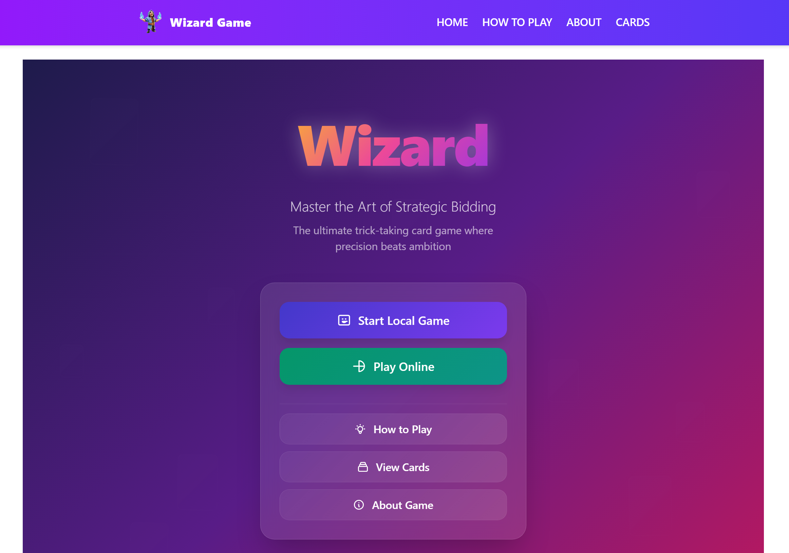

# World Wide Wizard

World Wide Wizard is a digital implementation of the classic card game "Wizard" by Amigo. This web-based version allows players to enjoy the game online without needing physical cards or being in the same location.

---

## Disclaimer & Copyright
This is an unofficial digital implementation created for educational and entertainment purposes. All rights to the original Wizard card game belong to AMIGO Spiel + Freizeit GmbH and Ken Fisher. No commercial use intended.

## About the Game

Wizard is a trick-taking card game where players must predict exactly how many tricks they will win each round. The game features:

- **60 unique cards**: 4 suits (Red, Blue, Green, Yellow) with 13 cards each, plus 4 Wizard cards and 4 Fool cards
- **Strategic bidding**: Players must predict their tricks before each round begins  
- **Variable rounds**: The number of cards dealt increases each round
- **Multiple players**: Supports 3-6 players (currently configured for 3+ players)

---

- **Automated game flow** with bidding, playing, and scoring phases

## Gallery



## How to Play

1. **Setup**: Enter player names on the setup screen and start a new game.
2. **Bidding Phase**: Each player predicts (bids) how many tricks they will win in the current round. Bids are made in turn order and are visible to all players.
3. **Playing Phase**: Players take turns playing one card per trick. The first player leads, and all others must follow suit if possible (**Servning**) or play a Wizard or Fool. If a player cannot follow suit, they may play any card, including trumps.
4. **Trick Resolution**:
   - The highest trump wins the trick.
   - If no trumps are played, the highest card of the led suit wins.
   - Wizard cards always win the trick; Fool cards always lose.
5. **Scoring**: After all tricks are played, points are awarded:
   - **Exact prediction**: 20 points plus 10 points per trick won
   - **Wrong prediction**: -10 points for each trick difference
6. **Next Round**: The number of cards dealt increases by one each round. The game continues until all cards are dealt.

### Card Hierarchy
- **Wizard cards**: Always win tricks (highest)
- **Fool cards**: Always lose tricks (lowest)
- **Numbered cards**: 1-13 in each suit, with 13 being highest
- **Trump suit**: Changes each round, trump cards beat non-trump cards

---

## Quick Start

### Prerequisites

- Node.js (version 18 or higher)
- npm

### Installation & Start

One can access the website under: 
https://worldwidewizard.vercel.app/

0. **To test and use online gaming, start the local socket server in a separate terminal:**
   ```bash
   cd socket-server
   npm install
   node index.js
   ```

1. **Clone the repository**
   ```bash
   git clone https://github.com/tf664/worldwidewizard.git
   cd worldwidewizard
   ```
2. **Install dependencies**
   ```bash
   npm install
   ```
3. **Start the development server**
   ```bash
   npm run dev
   # or open automatically in browser
   npm run dev -- --open
   ```
4. **Open your browser** and navigate to the shown localhost address (z.B. http://localhost:5173)

#### Image Optimization (optional)
Um die Kartenbilder für die Web-App zu optimieren, führe folgendes Skript aus:
```bash
node scripts/optimize-images.js
```
Die optimierten Bilder werden im Ordner `static/rcs/cards-optimized` abgelegt.


## Development

### Tech Stack

**Framework & Build Tools:**
- [Svelte 5](https://svelte.dev/) - Modern reactive framework
- [SvelteKit](https://kit.svelte.dev/) - Full-stack Svelte framework  
- [Vite](https://vitejs.dev/) - Fast build tool and dev server
- [TypeScript](https://www.typescriptlang.org/) - Type-safe JavaScript

**Styling:**
- [Tailwind CSS 4.0](https://tailwindcss.com/) - Utility-first CSS framework
- [@tailwindcss/typography](https://tailwindcss.com/docs/typography-plugin) - Beautiful typography defaults
- Custom card graphics and game table design

**Code Quality:**
- [ESLint](https://eslint.org/) - JavaScript/TypeScript linting
- [Prettier](https://prettier.io/) - Code formatting
- [eslint-plugin-svelte](https://svelte.dev/docs/eslint) - Svelte-specific linting

**Testing:**
- [Playwright](https://playwright.dev/) - End-to-end testing

**Image Processing:**
- [Sharp](https://sharp.pixelplumbing.com/) - High-performance image processing

### Available Scripts

```bash
# Development
npm run dev          # Start development server
npm run dev -- --open  # Start dev server and open browser

# Development regarding card ressources
```bash
node scripts/optimize-images.js 
```


### Project Structure

```
worldwidewizard/
├── e2e/
│   └── demo.test.ts                # Not yet used: End-to-end tests (Playwright)
├── scripts/
│   └── optimize-images.js          # Image optimization script (Sharp)
├── socket-server/
│   ├── index.js                    # WebSocket server
│   └── package.json                # Server dependencies
├── src/
│   ├── app.css                     # Global styles
│   ├── app.d.ts                    # TypeScript declarations
│   ├── app.html                    # HTML template
│   ├── lib/
│   │   ├── index.ts                # Library entry point
│   │   ├── components/
│   │   │   ├── CardImage.svelte        # Card image component
│   │   │   ├── GameImagePreloader.svelte # Preloads card images
│   │   │   └── Popup.svelte            # Popup/modal component
│   │   ├── stores/
│   │   │   ├── lobby.ts                # Lobby state
│   │   │   ├── socket.ts               # Socket state
│   │   │   └── user.ts                 # User state
│   │   └── utils/
│   │       └── cardImagePreloader.ts   # Card image preloading logic
│   ├── routes/
│   │   ├── +layout.svelte              # Root layout
│   │   ├── +page.svelte                # Home page
│   │   ├── Menu.svelte                 # Main menu
│   │   ├── about/
│   │   │   ├── +layout.svelte
│   │   │   └── +page.svelte
│   │   ├── cards/
│   │   │   ├── +layout.svelte
│   │   │   ├── +page.svelte
│   │   │   ├── CardImage.svelte
│   │   │   └── specificCard/
│   │   ├── game/
│   │   │   ├── +page.svelte
│   │   │   ├── components/
│   │   │   ├── logic/
│   │   │   └── types/
│   │   ├── howtoplay/
│   │   │   ├── +layout.svelte
│   │   │   └── +page.svelte
│   │   ├── lobby/
│   │   │   └── [code]/
│   │   ├── onlinegame/
│   │   │   ├── [code]/
│   │   │   └── components/
│   │   ├── onlinesetup/
│   │   │   └── +page.svelte
│   │   └── setup/
│   │       └── +page.svelte
├── static/
│   ├── favicon.svg                  # App favicon
│   ├── faviconSvelte.svg            # Svelte favicon
│   └── rcs/
│       ├── cards/                   # Original card images (JPG/PNG)
│       └── cards-optimized/         # Optimized card images (WebP)
├── eslint.config.js                 # ESLint configuration
├── package.json                     # Project dependencies and scripts
├── playwright.config.ts             # Playwright test config
├── README.md                        # Project documentation
├── svelte.config.js                 # Svelte config
├── tsconfig.json                    # TypeScript config
└── vite.config.ts                   # Vite config
```

## Deployment

Vercel

## Roadmap

- [x] **Online multiplayer** support with WebSockets
- [ ] **Server hosting** 
- [ ] **AI opponents** for single-player mode  
- [ ] **Statistics tracking** and player profiles
- [ ] **Additional card themes** and customizations
- [ ] **Spectator mode** for watching games
